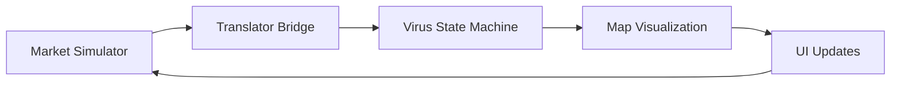

# SolFlu System Architecture - Development Benchmark 1

## File Structure
```
src/
├── actual-components/
│   ├── components/
│   │   ├── SimpleSpreadMap.js     # Main visualization component
│   │   ├── OrderBookDisplay.js    # Trading DOM interface
│   │   └── DeveloperControls.js   # Additional dev controls
│   ├── core/
│   │   ├── virus-state-machine.js # Virus behavior engine
│   │   ├── mutation-system.js     # Virus mutation handling
│   │   └── transmission-patterns.js# Spread pattern management
│   └── integration/
│       ├── market-simulator.js    # Market simulation engine
│       └── translator-bridge.js   # Market-virus connection
├── components/
│   └── DevPanel.js               # Development control panel
└── styles/
    └── App.css                   # Global styles
```

## Core Systems

### 1. Market System (`market-simulator.js`)
```javascript
// Class Structure
- Order           // Individual order management
- PriceLevel      // Price level aggregation
- OrderBook       // Order book functionality
- MarketSimulator // Top-level simulation
```

**Key Features:**
- Real-time order book simulation
- Dynamic price discovery
- Whale order events
- Market metrics calculation
- Order aging system

### 2. Virus System (`virus-state-machine.js`)
```javascript
// Class Structure
- VirusPoint       // Individual point management
- Territory        // Spatial management
- VirusStateMachine// Main behavior control
```

**Key Features:**
- Market-driven spread patterns
- Territory management
- Intensity-based visualization
- Edge-based growth
- Mutation response

## UI Components

### 1. Trading DOM (`OrderBookDisplay.js`)
```javascript
// Component Structure
- OrderRow         // Individual order display
- OrderBookDisplay // Main DOM container
```

**Features:**
- Compact design (220px width)
- Real-time order updates
- Market metrics display
- Price level visualization
- Order age tracking

### 2. Dev Panel (`DevPanel.js`)
```javascript
// Component Structure
- PanelContainer  // Styled container
- ButtonGroup     // Control buttons
```

**Controls:**
- Boost Virus Spread
- Suppress Virus
- Reset Simulation
- Collapsible Interface

## Integration Flow



## Component Interactions

### Market → Virus Translation
```javascript
// market-simulator.js
marketRef.current.subscribe((newMarketData) => {
    setMarketData(newMarketData);
    const translatedParams = translatorRef.current.translateMarketState(newMarketData);
    virusRef.current.updateParams(translatedParams);
});
```

### Virus → Visualization
```javascript
// SimpleSpreadMap.js
const animate = () => {
    const deltaTime = (now - lastTimeRef.current) / 1000;
    virusRef.current.update(deltaTime);
    const points = virusRef.current.getPoints();
    updateVisualization(points);
};
```

## Development Controls

### Boost/Suppress Functions
```javascript
// virus-state-machine.js
boostSpread(multiplier) {
    this.params.intensity *= multiplier;
    this.params.speed *= multiplier;
    this.growthMultiplier *= multiplier;
}

suppressSpread(multiplier) {
    this.params.intensity *= multiplier;
    this.params.speed *= multiplier;
    this.growthMultiplier *= multiplier;
}
```

## Styling System

### DOM Styling
```javascript
const containerStyle = {
    width: '220px',
    backgroundColor: 'rgba(17, 19, 23, 0.95)',
    maxHeight: '70vh',
    // ... other styles
};
```

### Dev Panel Styling
```javascript
const PanelContainer = styled.div`
    position: fixed;
    top: 20px;
    left: 20px;
    background: rgba(28, 32, 38, 0.95);
    // ... other styles
`;
```

## Current Working Features

### Market Features
- Real-time order simulation
- Price discovery
- Whale events
- Market metrics
- Order management

### Virus Features
- Market-driven patterns
- Territory system
- Intensity visualization
- Growth mechanics
- Mutation system

### UI Features
- Compact trading DOM
- Development controls
- Interactive map
- Real-time updates
- Performance optimization

## Integration Chain
1. Market generates orders
2. Translator converts state
3. Virus updates behavior
4. Map renders changes
5. UI reflects updates
6. Controls modify system

## Component Communication

### Market Simulator → Virus State Machine
- Market data updates trigger virus parameter adjustments
- Volatility affects spread intensity
- Market cap influences territory size
- Price movements affect spread patterns

### Virus State Machine → Visualization
- Point positions update map display
- Intensity values control point size
- Color intensity reflects market volatility
- Territory changes affect spread patterns

### Dev Panel → System Control
- Direct manipulation of virus parameters
- Market volatility injection
- System state reset capability
- Real-time behavior modification

## Performance Considerations
- Efficient point rendering using DeckGL
- Optimized order book updates
- Territory management with spatial indexing
- Throttled market updates
- Smooth animation frame handling

## Technical Stack
- React for UI components
- DeckGL for map visualization
- Mapbox for base map
- Styled-components for styling
- JavaScript ES6+ for core logic

## Development Status
- ✅ Market simulation system
- ✅ Virus behavior engine
- ✅ Map visualization
- ✅ Trading DOM interface
- ✅ Development controls
- ✅ System integration
- ✅ Performance optimization
- ✅ Real-time updates

This architecture creates a seamless, interactive system where market activity drives virus behavior, visualized through an intuitive interface with development controls. The system maintains high performance while providing real-time updates and responsive controls. 